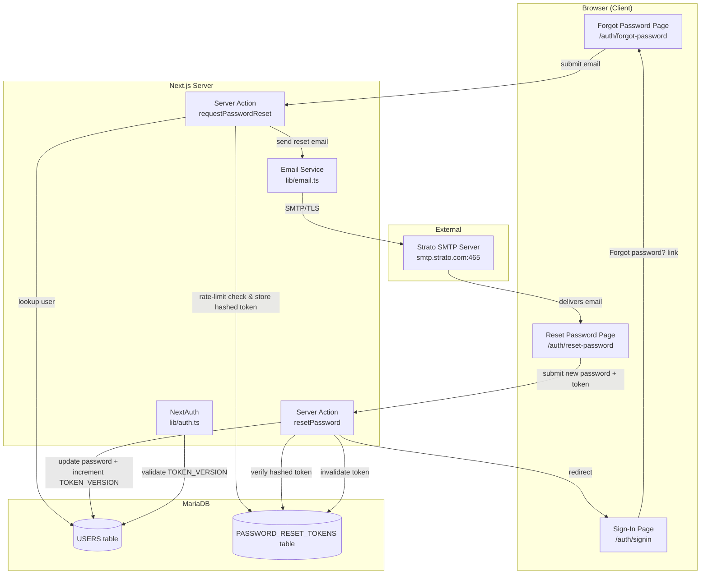
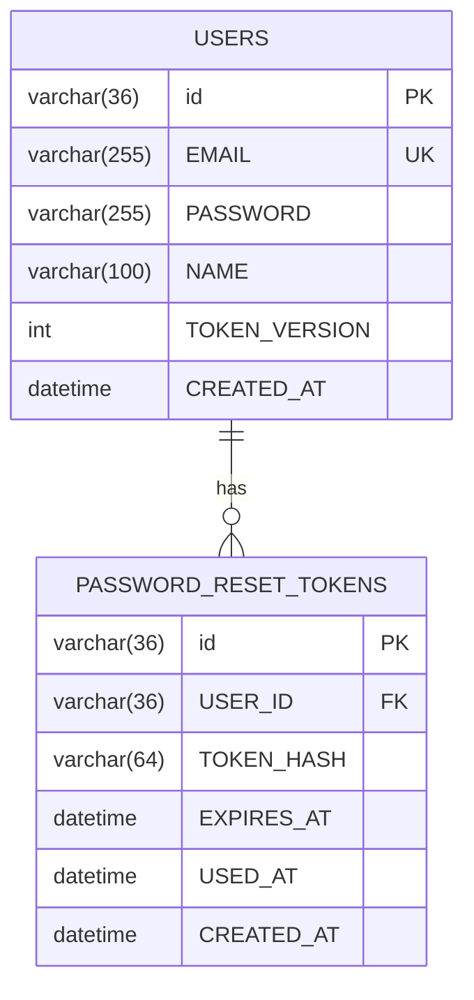
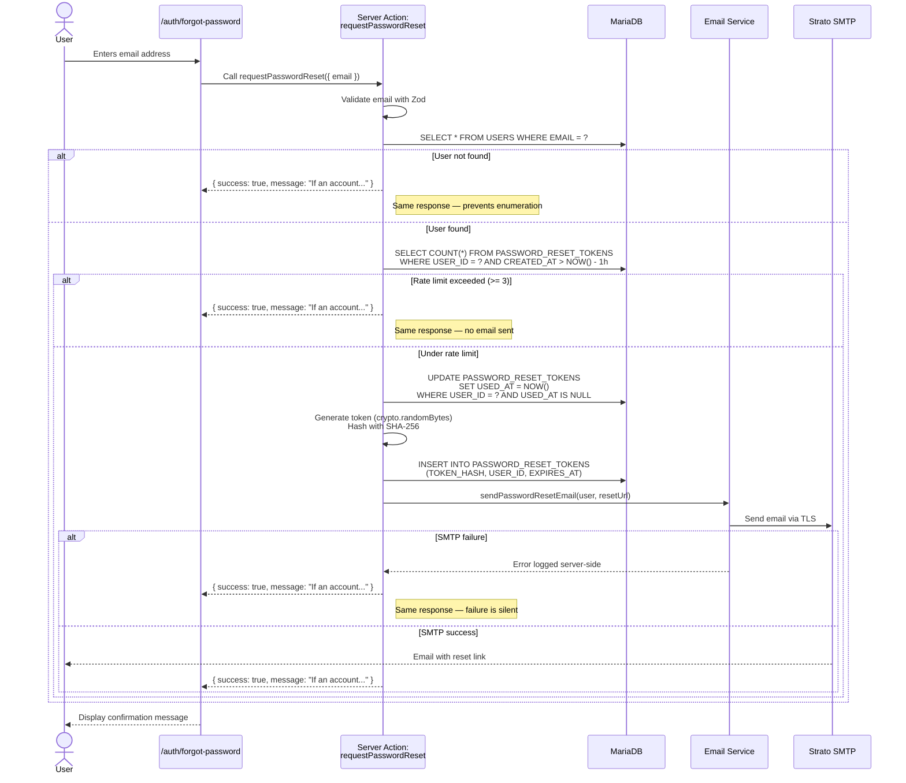
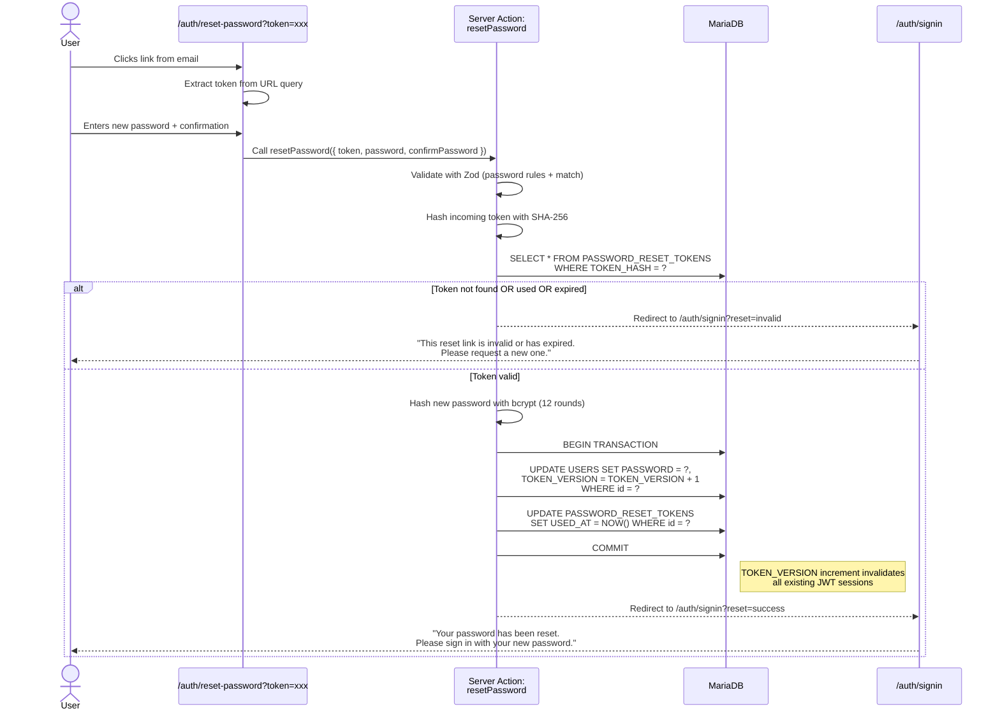
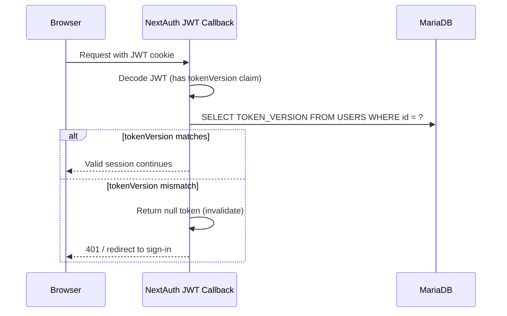

# Technical Design: Password Forgotten Functionality

## 1. System Architecture Overview

### Components & Layers

The password forgotten feature adds a self-service password recovery flow to the existing MyGuitars authentication system. It introduces four new architectural components that integrate with the existing Next.js App Router, TypeORM, and NextAuth infrastructure.



### Integration Points

| Existing Component | Change Required |
|---|---|
| `app/auth/signin/page.tsx` | Add "Forgot password?" link below the sign-in form |
| `lib/auth.ts` | Extend JWT callback to include `tokenVersion`; validate against DB on session refresh |
| `lib/db.ts` | Register new `PasswordResetToken` entity in the DataSource |
| `lib/schemas.ts` | Add `passwordSchema` and `forgotPasswordSchema` Zod schemas |
| `entities/User.ts` | Add `TOKEN_VERSION` column (INT, default 1) |

### New Components

| Component | Type | Purpose |
|---|---|---|
| `entities/PasswordResetToken.ts` | TypeORM Entity | ORM mapping for the PASSWORD_RESET_TOKENS table |
| `lib/email.ts` | Service Module | Nodemailer wrapper for Strato SMTP |
| `app/actions/auth.ts` | Server Actions | `requestPasswordReset()` and `resetPassword()` |
| `app/auth/forgot-password/page.tsx` | Page (Client) | Email input form for requesting a reset |
| `app/auth/reset-password/page.tsx` | Page (Client) | New password form (receives token via URL query param) |
| `mariadb_migration_add_password_reset.sql` | SQL Migration | Creates PASSWORD_RESET_TOKENS table and adds TOKEN_VERSION to USERS |

---

## 2. Technology Stack

| Concern | Choice | Justification |
|---|---|---|
| Email delivery | **nodemailer** (new dependency) | De facto Node.js SMTP library; 15M+ weekly npm downloads; supports TLS/STARTTLS; zero vendor lock-in since we connect directly to Strato SMTP |
| Token generation | **Node.js `crypto` module** (built-in) | `crypto.randomBytes(32)` produces 256 bits of cryptographic randomness — no additional dependency needed |
| Token hashing | **SHA-256 via `crypto.createHash`** (built-in) | Tokens are already high-entropy (256-bit random), so a fast hash is sufficient and appropriate. bcrypt would add unnecessary latency for token lookups. |
| Password hashing | **bcryptjs** (already installed) | Already used for registration/login; salt rounds: 12 — consistent with existing implementation |
| Form validation | **Zod** (already installed) | Shared password schema between client and server; integrates with react-hook-form via zodResolver |
| Form handling | **react-hook-form** (already installed) | Consistent with existing form patterns in the project |
| CSRF protection | **Next.js Server Actions** (built-in) | Server actions include automatic CSRF token validation — no additional middleware needed (addresses audit R3) |

### New Dependency

```json
{
  "nodemailer": "^7.0.3"
}
```

Also install `@types/nodemailer` as a dev dependency for TypeScript support.

---

## 3. Data Model

### 3.1 New Table: PASSWORD_RESET_TOKENS

```sql
CREATE TABLE IF NOT EXISTS PASSWORD_RESET_TOKENS (
    id VARCHAR(36) NOT NULL,
    USER_ID VARCHAR(36) NOT NULL,
    TOKEN_HASH VARCHAR(64) NOT NULL,
    EXPIRES_AT DATETIME NOT NULL,
    USED_AT DATETIME DEFAULT NULL,
    CREATED_AT DATETIME NOT NULL DEFAULT CURRENT_TIMESTAMP,
    PRIMARY KEY (id),
    INDEX IDX_PRT_USER_ID (USER_ID),
    INDEX IDX_PRT_TOKEN_HASH (TOKEN_HASH),
    INDEX IDX_PRT_EXPIRES_AT (EXPIRES_AT),
    CONSTRAINT FK_PRT_USER FOREIGN KEY (USER_ID)
        REFERENCES USERS(id) ON DELETE CASCADE
);
```

**Column Details:**

| Column | Type | Description |
|---|---|---|
| `id` | VARCHAR(36) | UUID primary key, auto-generated |
| `USER_ID` | VARCHAR(36) | Foreign key to USERS.id |
| `TOKEN_HASH` | VARCHAR(64) | SHA-256 hex digest of the raw token (never store raw token) |
| `EXPIRES_AT` | DATETIME | Token expiration time (created_at + 1 hour) |
| `USED_AT` | DATETIME, nullable | Timestamp when token was consumed; NULL means unused |
| `CREATED_AT` | DATETIME | Auto-set on creation |

### 3.2 USERS Table Modification

```sql
ALTER TABLE USERS
    ADD COLUMN TOKEN_VERSION INT NOT NULL DEFAULT 1;
```

**Purpose:** Enables JWT session invalidation. When a password is reset, `TOKEN_VERSION` is incremented. The JWT callback compares the stored version against the database — a mismatch signals that the session is stale and the user must re-authenticate. (Addresses audit W1.)

### 3.3 New TypeORM Entity: PasswordResetToken

```typescript
// entities/PasswordResetToken.ts
@Entity("PASSWORD_RESET_TOKENS")
export class PasswordResetToken {
    @PrimaryGeneratedColumn("uuid")
    id: string;

    @Column({ name: "USER_ID" })
    userId: string;

    @Column({ name: "TOKEN_HASH", length: 64 })
    tokenHash: string;

    @Column({ name: "EXPIRES_AT", type: "datetime" })
    expiresAt: Date;

    @Column({ name: "USED_AT", type: "datetime", nullable: true })
    usedAt: Date | null;

    @CreateDateColumn({ name: "CREATED_AT" })
    createdAt: Date;

    @ManyToOne(() => User, { onDelete: "CASCADE" })
    @JoinColumn({ name: "USER_ID" })
    user: User;
}
```

### 3.4 User Entity Update

Add to `entities/User.ts`:

```typescript
@Column({ name: "TOKEN_VERSION", type: "int", default: 1 })
tokenVersion: number;
```

### 3.5 Entity Relationship Diagram



### 3.6 Migration File

File: `mariadb_migration_add_password_reset.sql`

```sql
-- Migration: Add password reset infrastructure
-- Date: 2026-04-17

-- 1. Create PASSWORD_RESET_TOKENS table
CREATE TABLE IF NOT EXISTS PASSWORD_RESET_TOKENS (
    id VARCHAR(36) NOT NULL,
    USER_ID VARCHAR(36) NOT NULL,
    TOKEN_HASH VARCHAR(64) NOT NULL,
    EXPIRES_AT DATETIME NOT NULL,
    USED_AT DATETIME DEFAULT NULL,
    CREATED_AT DATETIME NOT NULL DEFAULT CURRENT_TIMESTAMP,
    PRIMARY KEY (id),
    INDEX IDX_PRT_USER_ID (USER_ID),
    INDEX IDX_PRT_TOKEN_HASH (TOKEN_HASH),
    INDEX IDX_PRT_EXPIRES_AT (EXPIRES_AT),
    CONSTRAINT FK_PRT_USER FOREIGN KEY (USER_ID)
        REFERENCES USERS(id) ON DELETE CASCADE
) ENGINE=InnoDB DEFAULT CHARSET=utf8mb4 COLLATE=utf8mb4_unicode_ci;

-- 2. Add TOKEN_VERSION to USERS for JWT session invalidation
ALTER TABLE USERS
    ADD COLUMN TOKEN_VERSION INT NOT NULL DEFAULT 1;
```

---

## 4. API / Server Action Schema

All password-reset mutations use **Next.js Server Actions** (not API routes), consistent with the project's convention of using server actions for non-binary form mutations. Server actions provide built-in CSRF protection.

### 4.1 `requestPasswordReset` — Server Action

**File:** `app/actions/auth.ts`

**Input:**
```typescript
// Zod schema
const forgotPasswordSchema = z.object({
    email: z.string().email("Please enter a valid email address"),
});
```

**Behavior:**
1. Validate input with `forgotPasswordSchema`
2. Normalize email: `email.toLowerCase().trim()`
3. Look up user by email in USERS table
4. **If user not found** → return same success response (account enumeration prevention)
5. **Rate-limit check:** count tokens for this user where `CREATED_AT > NOW() - INTERVAL 1 HOUR`. If count >= 3 → return same success response, do not send email (addresses BRD Section 5)
6. **Invalidate prior tokens:** set `USED_AT = NOW()` on all unused tokens for this user (addresses audit W4 — only the most recent token is valid)
7. Generate raw token: `crypto.randomBytes(32).toString('hex')`
8. Hash token: `crypto.createHash('sha256').update(rawToken).digest('hex')`
9. Store in PASSWORD_RESET_TOKENS with `EXPIRES_AT = NOW() + 1 hour`
10. Build reset URL: `${process.env.NEXTAUTH_URL}/auth/reset-password?token=${rawToken}`
11. Send email via `lib/email.ts` — if SMTP fails, log the error server-side and still return the same success response (addresses audit W5)
12. Return: `{ success: true, message: "If an account with that email exists, we have sent a password reset link." }`

**Response Shape:**
```typescript
type RequestResetResult = {
    success: boolean;
    message: string;
};
```

### 4.2 `resetPassword` — Server Action

**File:** `app/actions/auth.ts`

**Input:**
```typescript
const resetPasswordSchema = z.object({
    token: z.string().length(64, "Invalid token"),
    password: passwordSchema,      // see Section 4.3
    confirmPassword: z.string(),
}).refine((data) => data.password === data.confirmPassword, {
    message: "Passwords do not match",
    path: ["confirmPassword"],
});
```

**Behavior:**
1. Validate input with `resetPasswordSchema`
2. Hash the incoming token: `crypto.createHash('sha256').update(token).digest('hex')`
3. Look up token in PASSWORD_RESET_TOKENS by `TOKEN_HASH`
4. **Validation checks** — if any fail, redirect to `/auth/signin` (silent redirect per BRD Section 2.3, with a brief flash message per audit R5):
   - Token not found → invalid
   - `USED_AT` is not NULL → already consumed
   - `EXPIRES_AT < NOW()` → expired
5. Hash new password: `bcrypt.hash(password, 12)`
6. **In a transaction:**
   a. Update USERS: set `PASSWORD = newHash`, increment `TOKEN_VERSION`
   b. Mark token as used: set `USED_AT = NOW()`
7. Redirect to `/auth/signin` with a success query parameter

**Response Shape:**
```typescript
type ResetPasswordResult =
    | { success: true }
    | { success: false; error: string };
```

### 4.3 Password Validation Schema

**File:** `lib/schemas.ts` (addition)

```typescript
export const passwordSchema = z
    .string()
    .min(8, "Password must be at least 8 characters")
    .regex(/[a-z]/, "Must contain at least one lowercase letter")
    .regex(/[A-Z]/, "Must contain at least one uppercase letter")
    .regex(/[0-9]/, "Must contain at least one digit")
    .regex(/[^a-zA-Z0-9]/, "Must contain at least one special character");
```

**Design decisions addressing audit findings:**
- **W2 (Digit requirement):** Included `.regex(/[0-9]/)` — adds digit requirement.
- **W3 (Special character ambiguity):** Defined as "any non-alphanumeric character" via `[^a-zA-Z0-9]`. This is unambiguous and accepts all printable special characters including backticks, tildes, and any Unicode symbols.

This schema should also be applied retroactively to the registration form for consistency, but that is out of scope for this card.

---

## 5. Data Flow Diagrams

### 5.1 Forgot Password Flow (Request Reset)



### 5.2 Reset Password Flow (Submit New Password)



### 5.3 JWT Session Invalidation Flow



**Performance note:** This adds one lightweight DB query per authenticated request. Given the app's connection pool (4 connections) and expected traffic, this is acceptable. To optimize further, the check can be performed only when the JWT is refreshed (e.g., every 5 minutes via `maxAge` setting) rather than on every request. See Section 7 for details.

---

## 6. Security Architecture

### 6.1 Account Enumeration Prevention

The `requestPasswordReset` action always returns the same generic message regardless of whether the email exists, the user is rate-limited, or the SMTP server fails. Response timing should also be consistent — add a minimum delay (e.g., 200ms) to prevent timing-based enumeration.

### 6.2 Token Security

| Concern | Mitigation |
|---|---|
| Token entropy | 256-bit random token via `crypto.randomBytes(32)` |
| Token storage | SHA-256 hash stored in DB; raw token never persisted server-side |
| Token lifetime | 1-hour expiration enforced at validation time |
| Token reuse | `USED_AT` column; checked before processing; set atomically during reset |
| Concurrent tokens | Prior unused tokens are invalidated when a new one is issued (audit W4) |

### 6.3 Password Security

| Concern | Mitigation |
|---|---|
| Hash algorithm | bcrypt with 12 salt rounds (consistent with existing registration) |
| Complexity | Zod schema enforces: min 8 chars, uppercase, lowercase, digit, special character |
| Transmission | All pages served over HTTPS; password sent in POST body (server action), never in URL |

### 6.4 Session Invalidation (Audit W1)

When a password is reset:
1. `TOKEN_VERSION` in the USERS row is incremented
2. The JWT `jwt` callback checks `token.tokenVersion` against the DB value
3. Mismatched versions cause the callback to return an empty token, forcing re-authentication
4. This effectively logs the user out on all devices/browsers

### 6.5 Rate Limiting

- **Limit:** 3 password reset requests per email per rolling 1-hour window
- **Implementation:** Count `PASSWORD_RESET_TOKENS` rows for the user where `CREATED_AT > NOW() - INTERVAL 1 HOUR`
- **Exceeded behavior:** No email sent, same generic response returned
- **No separate rate-limit table needed** — the tokens table serves double duty

### 6.6 CSRF Protection

Server actions in Next.js include automatic CSRF token validation. No additional middleware is required. (Addresses audit R3.)

### 6.7 SMTP Credential Storage

All SMTP credentials are stored in environment variables, never in source code. (Addresses audit R1.)

```
SMTP_HOST=smtp.strato.com
SMTP_PORT=465
SMTP_SECURE=true
SMTP_USER=<provided by stakeholder>
SMTP_PASSWORD=<provided by stakeholder>
SMTP_FROM=noreply@<domain>
```

### 6.8 SMTP Failure Handling (Audit W5)

If the Strato SMTP server is unreachable or returns an error:
- The error is logged server-side via `console.error` with relevant context (timestamp, email hash, error message)
- The user receives the same generic success message ("If an account with that email exists...")
- No retry is attempted — the user can manually request again (within rate limits)

---

## 7. Scalability Considerations

### 7.1 Token Cleanup

Expired and used tokens accumulate over time. Two approaches (implement the simpler one first):

**Option A — Lazy cleanup (recommended for current scale):**
When `requestPasswordReset` runs, also delete tokens where `EXPIRES_AT < NOW() - INTERVAL 24 HOURS` for the specific user. This keeps the table tidy without a background job.

**Option B — Scheduled cleanup (if table grows):**
A cron job or Next.js API route triggered by an external scheduler runs:
```sql
DELETE FROM PASSWORD_RESET_TOKENS
WHERE EXPIRES_AT < DATE_SUB(NOW(), INTERVAL 7 DAY);
```

### 7.2 JWT Validation Overhead

The `TOKEN_VERSION` check adds a DB query per JWT refresh. To control overhead:
- Set `session.maxAge` to a reasonable value (e.g., 24 hours) — already the NextAuth default
- The JWT callback's trigger parameter distinguishes `"update"` from initial sign-in; only query the DB on session refresh, not on every request
- With 4 connection pool slots and low traffic, this is negligible

### 7.3 Email Throughput

Strato SMTP has sending limits (typically 500-1000/hour for business accounts). For the expected user base of MyGuitars, this is more than sufficient. The 3-per-hour rate limit per email also naturally throttles volume.

### 7.4 Database Indexing

The migration includes indexes on:
- `IDX_PRT_TOKEN_HASH` — fast lookup by hashed token during reset
- `IDX_PRT_USER_ID` — fast count for rate limiting and token invalidation
- `IDX_PRT_EXPIRES_AT` — efficient cleanup queries

---

## 8. Implementation Phases

### Phase 1: Database & Entity Layer
**Files:** `mariadb_migration_add_password_reset.sql`, `entities/PasswordResetToken.ts`, `entities/User.ts`, `lib/db.ts`

- Create and run the migration SQL
- Create the `PasswordResetToken` TypeORM entity
- Add `tokenVersion` field to the `User` entity
- Register `PasswordResetToken` in the DataSource entity list in `lib/db.ts`

### Phase 2: Validation Schemas
**Files:** `lib/schemas.ts`

- Add `passwordSchema` with all complexity rules (min 8, uppercase, lowercase, digit, special char)
- Add `forgotPasswordSchema` (email validation)
- Add `resetPasswordSchema` (token + password + confirmPassword with refinement)

### Phase 3: Email Service
**Files:** `lib/email.ts`, `.env.local`

- Install `nodemailer` and `@types/nodemailer`
- Create email service module with Strato SMTP configuration
- Implement `sendPasswordResetEmail(to, resetUrl)` function
- Plain-text email body with reset link (per BRD: no-frills style)
- Add SMTP environment variables to `.env.local`

### Phase 4: Server Actions
**Files:** `app/actions/auth.ts`

- Implement `requestPasswordReset` server action (full flow: validate, lookup, rate-limit, invalidate old tokens, generate, hash, store, email)
- Implement `resetPassword` server action (full flow: validate, hash token, lookup, verify, hash password, transaction update, redirect)
- Add consistent-timing delay to prevent enumeration

### Phase 5: Frontend Pages
**Files:** `app/auth/forgot-password/page.tsx`, `app/auth/reset-password/page.tsx`, `app/auth/signin/page.tsx`

- Create forgot-password page with email form, react-hook-form + zodResolver, success confirmation message
- Create reset-password page that reads `token` from URL search params, password + confirm form, validation feedback, redirect on success/failure
- Add "Forgot password?" link to the sign-in page
- Handle `?reset=success` and `?reset=invalid` query params on sign-in page for flash messages

### Phase 6: Session Invalidation
**Files:** `lib/auth.ts`

- Extend the `jwt` callback to store `tokenVersion` on sign-in
- Add version check logic: on session refresh, query `TOKEN_VERSION` from DB and compare with JWT claim
- Return null/empty token on mismatch to force re-authentication

### Phase 7: Styling & Polish
**Files:** CSS files, existing component adjustments

- Style the forgot-password and reset-password pages to match existing auth page design (sign-in / register)
- Ensure dark/light theme compatibility via existing CSS variables
- Password requirement hints displayed below the password field
- Loading states on form submissions
- Mobile responsiveness

---

## 9. Audit Response Matrix

This section maps every audit warning and recommendation to the design decision that addresses it.

| Audit Item | Resolution |
|---|---|
| **W1:** JWT session invalidation | `TOKEN_VERSION` column on USERS + JWT callback check (Section 6.4) |
| **W2:** Missing digit requirement | Added to `passwordSchema`: `.regex(/[0-9]/)` (Section 4.3) |
| **W3:** Ambiguous special character set | Defined as any non-alphanumeric: `[^a-zA-Z0-9]` (Section 4.3) |
| **W4:** Concurrent token behavior | New request invalidates all prior unused tokens (Section 4.1, step 6) |
| **W5:** SMTP failure handling | Log error server-side, return same generic message (Section 6.8) |
| **R1:** SMTP credential storage | Environment variables only (Section 6.7) |
| **R2:** Reset URL format | `${NEXTAUTH_URL}/auth/reset-password?token=${rawToken}` (Section 4.1, step 10) |
| **R3:** CSRF protection | Built-in via Next.js server actions (Section 6.6) |
| **R4:** Logging | Server-side `console.error` for SMTP failures and security events (Section 6.8) |
| **R5:** Silent redirect UX | Redirect to sign-in with query param; display brief, non-revealing message (Section 4.2) |
| **R6:** Email uniqueness assumption | Confirmed by `UNIQUE KEY UQ_USERS_EMAIL` in schema (no design change needed) |

---

## 10. File Summary

| File | Action | Purpose |
|---|---|---|
| `mariadb_migration_add_password_reset.sql` | **Create** | Migration: new table + USERS column |
| `entities/PasswordResetToken.ts` | **Create** | TypeORM entity for reset tokens |
| `entities/User.ts` | **Modify** | Add `tokenVersion` field |
| `lib/db.ts` | **Modify** | Register PasswordResetToken entity |
| `lib/schemas.ts` | **Modify** | Add password, forgotPassword, resetPassword schemas |
| `lib/email.ts` | **Create** | Nodemailer SMTP service for Strato |
| `app/actions/auth.ts` | **Create** | Server actions: requestPasswordReset, resetPassword |
| `app/auth/forgot-password/page.tsx` | **Create** | Forgot password form page |
| `app/auth/reset-password/page.tsx` | **Create** | Reset password form page |
| `app/auth/signin/page.tsx` | **Modify** | Add "Forgot password?" link + flash messages |
| `lib/auth.ts` | **Modify** | JWT callback: tokenVersion claim + DB validation |
| `package.json` | **Modify** | Add nodemailer dependency |